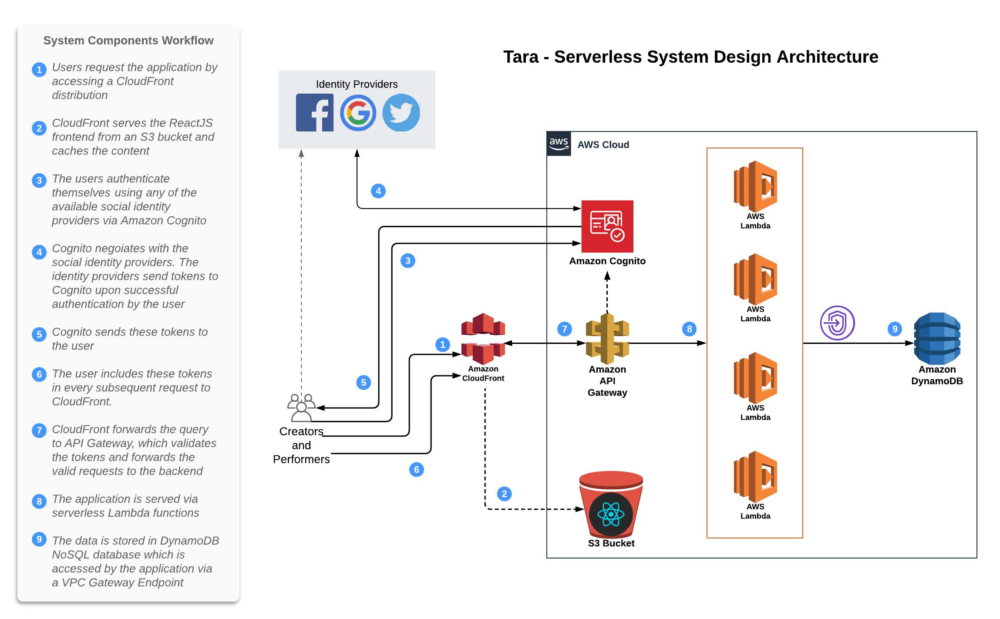
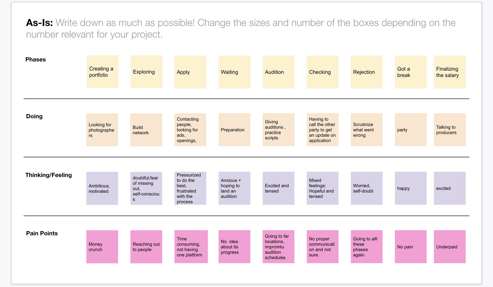
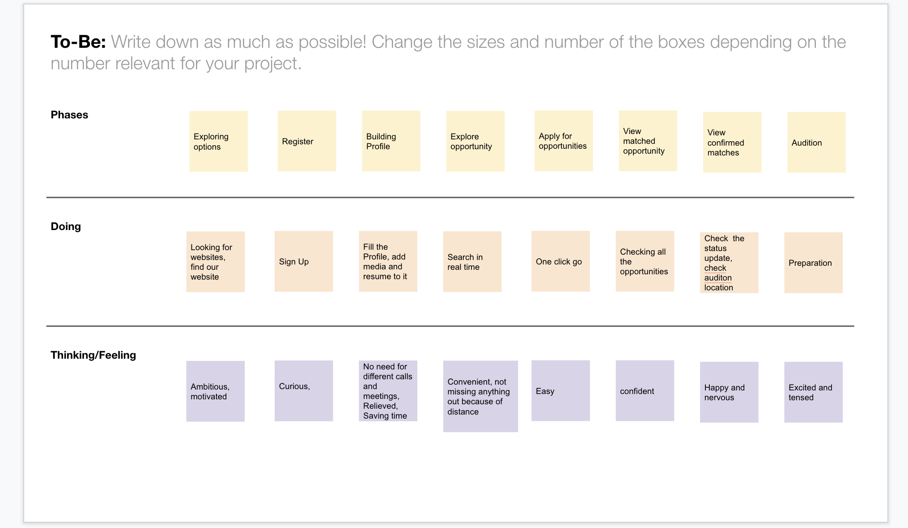

# Tara

 A place where talent meets opportunity.

# Team

1. Akshay Elavia
2. Purvi Misal
3. Shivani Jain
4. Sai Chaitanya Dasari

# Mentored By 
  Siva Sreeraman 
  
We followed agile methodology by having weekly Scrum with Siva and it helped us in meeting the check points and deliver things at right time. 
   
# Abstract 

Indian cinema is the largest national film industry in terms of the number of films produced and the number of tickets sold, with 3.5 billion tickets sold worldwide annually.Having said that, If you are the person who has this passion for pursuing your career in Cinema. Either it may be on-screen like a Lead actor, actress, junior artist or off-screen Direction of Photography, Director, Playback Singer, Dance Choreographer, etc.. You might be located in many rural parts of India but we heard you. On the other hand, dear passionate Indian Movie Makers are you looking for some passionate, young, new talent and dedicated artists to showcase in your upcoming dream project? Yes, we heard you too.

TARA is here .. Come build your dream future with us. This is the place where real talent meets the right opportunity.

Who are we?

Tara is a real-time entertainment-industry brand aimed at connecting local performing talent, with a special focus on casting, job opportunities, and much more.

# Persona/Target Users:
Where Talent meets Opportunity. 

1) Talent: Performing artists and backstage professionals looking for work in film, television, theater, commercials, voiceover, radio, gaming and other mediums who seek opportunity to find their next role and manage their careers.

2) Opportunity: Casting directors and  recruiters looking to hire the perfect artistic talent and professional backstage crew for their projects. 

# Hill Statement
Tara: Bringing together Talent and Opportunity in the Performing Arts industries through a common platform.

# Technology

### Architecture

### Optional Serverless Architecture

### Cloud Native Architecture
The application is designed using cloud native technologies, specifically AWS. The frontend will be served as a static website from an S3 bucket. The authentication and authorization will be via third party social identity providers using AWS Cognito. The stateless NodeJS servers will be running as Docker containers in an AWS ECS cluster. To provide global latency-free access to the application, the website will be served via a CloudFront CDN

### Backend Services
We will be using NodeJs APIs to fetch the values from the DynamoDB database. Since our application will render information on run-time, the non-blocking asynchronous nature of NodeJS will help us get good performance.

### Data Layer
The data will be stored and accessed from a serverless NoSQL database DynamoDB. DynamoDB provides document and key-value oriented storage structure which will assist in storing and querying unstructured data.

### Client Side
On the client side, we will make a ReactJS application. We are using ReactJS for the frontend as ReactJS is a light-weight library built over JavaScript, which doesn't re-render the entire DOM on change of components on the browser, rather it just re-renders the changed components. Hence ReactJS would improve application performance.

The frontend website is available at the following URL:
https://dgnchyrkhqge4.cloudfront.net/

### Design Thinking

